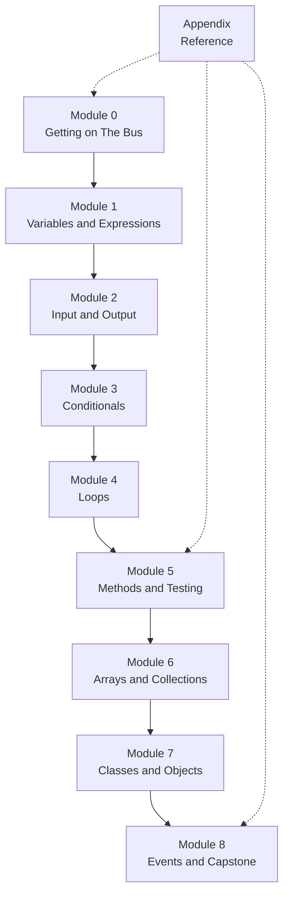

# Course Map — CSC 151 Java Programming I

This map shows the topic sequence for a one-semester introductory Java course. The course ships as **nine modules — Module 0 through Module 8 — plus an Appendix.** Some modules contain two submodules. The sequence is adaptable. Adjust the pacing or scope to fit your institution's needs, but keep the module count, because the delivery platform expects it.

---

## Overview

**Plain-text description:** The nine modules run in a single line. Module 0 leads to Module 1, which leads to Module 2, and so on in order through Module 8. The Appendix is not a step in the sequence. It is a reference that students consult from any module; the dotted lines show it being used at the start, in the middle, and at the end of the course.

Each solid arrow represents a dependency. Students should complete earlier modules before later ones.

---

## The spine at a glance

| Module | Title | Submodules | Primary CLOs |
|--------|-------|-----------|--------------|
| 0 | Getting on The Bus | Writing and diagrams · Environment and first program | CLO-1 |
| 1 | Variables and Expressions | — | CLO-2 |
| 2 | Input and Output | — | CLO-2 |
| 3 | Conditionals | — | CLO-1, CLO-2 |
| 4 | Loops | — | CLO-1, CLO-2 |
| 5 | Methods and Testing | Methods · Testing and debugging | CLO-2, CLO-5, CLO-6 |
| 6 | Arrays and Collections | — | CLO-2 |
| 7 | Classes and Objects | — | CLO-3 |
| 8 | Events and Capstone | Event-driven programming · Final project · 8a Swing track addendum | CLO-3, CLO-4, CLO-5 |
| Appendix | Reference | — | — |

---

## The LPAA cycle

Every module runs the same four beats, in the same order. The beats have two names each: the
instructional name, which is what the design documents use, and the course's own name, which
is what students hear.

| Beat | Course name | What happens | Graded |
|------|------------|--------------|--------|
| **Learn** | **Study the Play** | You read the concept and walk through a worked example. Nothing is at stake yet. | No |
| **Practice** | **Run the Play** | You rehearse one movement alone: trace a program on paper, repair a broken one. Answers are available. | No |
| **Apply** | **Team Practice** | You complete the handshake and write code with a coach present. Still not for a score. | No |
| **Assess** | **The Big Game** | You transfer the skill to a task you have not seen, and it counts. | Yes |

**Both names are correct and both stay.** The instructional names carry the mapping to
outcomes and to the delivery platform. The course names carry the reason a student should
trust the sequence. Neither replaces the other, and a document that uses one may use the
other beside it.

**Literal meaning of the four course names.** These are American football terms, and you do
not need to know anything about football to take this course:

| Course name | Literal meaning |
|-------------|----------------|
| Study the Play | Read and understand the one play you are about to run, before you run it. A play is a single planned movement, written down so a team can read it before rehearsing it. |
| Run the Play | Rehearse that same play by itself, slowly, with nothing at stake. |
| Team Practice | Do the whole thing with your coach beside you, still not for a score. |
| The Big Game | The work that counts toward your grade. |

### The rule the cycle exists to keep

> **"We would never make you use a play in The Big Game that you haven't run during practice
> until you understood it."**
>
> **Literal meaning:** nothing is graded that has not first been taught, rehearsed alone, and
> then practiced with a coach. If a skill is on the assessment, it appeared in all three
> earlier beats.

Call this the **no-new-plays rule**. It is the point of the cycle, and it is a design
constraint on the course rather than a promise about attitude.

**It is checkable, and it should be checked.** For every skill assessed in an Assess beat,
there is an earlier Learn beat that taught it, a Practice beat that rehearsed it, and an Apply
beat that ran it with a coach — in the same module or in an earlier one.

A skill that first appears in an Assess beat is a defect in the course, not a challenge for
the student. There are two repairs, and both are the author's work rather than the student's:

1. Add the missing beats before the assessment, or
2. Move the assessment to a later module where the beats already exist.

This is what makes the sequence trustworthy. A student who meets something unfamiliar in The
Big Game has found a bug, and should say so.

### Where the beats live inside a lesson

The fourteen lesson sections are not a separate structure. They are the four beats:

| Beat | Course name | Lesson sections |
|------|------------|-----------------|
| Learn | Study the Play | Learning goal · Prior knowledge check · Concept explanation · Worked example |
| Practice | Run the Play | Trace before running · Repair or modify code |
| Apply | Team Practice | Execute-gate handshake · Small coding task · Test evidence · Explanation |
| Assess | The Big Game | Role rotation · Transfer task · Reflection · Mastery record |

The **transfer task** is the load-bearing section of the Assess beat, because transfer is what
the no-new-plays rule protects. The task must be unfamiliar in its surface and familiar in
every skill it requires. A transfer task that needs a skill the lesson never rehearsed breaks
the rule.

**The gate sits at the Practice/Apply boundary.** Practice is where a wrong prediction costs
nothing, which is exactly why the prediction is written there. By Apply the student has
already been wrong once in private, and the handshake is a statement of what they now expect.

---

## Work surfaces

Students work in **GitHub Codespaces**, in **local VS Code with the Java extension**, or in both. Every graded task in this course runs on either surface.

Graphical (Swing) programs need a display, which a Codespace does not provide. For that reason **every assignment ships a console version**, and it is graded evidence in its own right, not a fallback. CLO-4 asks students to process a user event as a function call; selecting an option from a console menu does that, and so does pressing a Swing button. Students working locally may take either path. Students in a Codespace take the console path and lose no credit for it. See Module 8 below.

Each module README states its work surface. The Appendix carries the full work-surface matrix.

---

## Module descriptions

### Module 0 — Getting on The Bus

**Goal:** Students can use the course's writing and diagram tools, set up a Java development environment, run their first program, and state the four parts of the execute-gate handshake.

Submodule 0.1 — Writing and diagrams:
- Simplified Technical English (STE-100): active voice, one topic per sentence, one term per concept.
- Markdown: headers, bold, code blocks, lists, checklists, tables.
- Mermaid: reading and writing a flowchart with at least one decision.
- The execute-gate handshake, practiced in a non-coding context.

Submodule 0.2 — Environment and first program:
- Accessing a Codespace or setting up local VS Code with the Java extension.
- Writing a `public class` with a `main` method.
- Compiling and running from the command line or the IDE.
- Reading error messages.
- Working with an AI teammate, and what honest use requires.

Lessons in this repository: [0.1 Writing and diagrams](../modules/m0-getting-on-the-bus/lesson-1-writing-and-diagrams.md) · [0.2 Environment and first program](../modules/m0-getting-on-the-bus/lesson-2-environment-and-first-program.md) · [0.3 Work surfaces and the AI teammate](../modules/m0-getting-on-the-bus/lesson-3-work-surfaces-and-ai-teammate.md).

Suggested time: 3–4 class sessions. Lesson 0.3 is the third of three, and the 16-week calendar gives Module 0 four sessions.

---

### Module 1 — Variables and Expressions

**Goal:** Students can declare variables of primitive types, assign values, and evaluate arithmetic and string expressions.

Topics:
- Primitive types: `int`, `double`, `boolean`, `char`.
- Variable declaration and assignment.
- Arithmetic operators: `+`, `-`, `*`, `/`, `%`.
- Integer division and casting.
- String concatenation.
- `System.out.println` for output.

Lesson in this repository: [Module 1](../modules/m1-variables-expressions/lesson.md).

Suggested time: 2–3 class sessions.

---

### Module 2 — Input and Output

**Goal:** Students can read user input with `Scanner` and format output.

Topics:
- `import java.util.Scanner;`
- `System.in` and `Scanner` methods.
- `System.out.printf` for formatted output.
- Reading `int`, `double`, and `String` values.

Lesson in this repository: [Module 2](../modules/m2-input-output/lesson.md).

Suggested time: 2–3 class sessions.

---

### Module 3 — Conditionals

**Goal:** Students can write `if`, `if-else`, and nested conditional statements to control program flow.

Topics:
- Boolean expressions and relational operators (`<`, `>`, `==`, `!=`, `<=`, `>=`).
- Logical operators: `&&`, `||`, `!`.
- `if`, `if-else`, `else if` chains.
- `switch` statement, introduced as an alternative to long `else if` chains.
- Common mistakes: using `=` instead of `==`.

Lesson in this repository: [Module 3](../modules/m3-conditionals/lesson.md).

Suggested time: 2–3 class sessions.

---

### Module 4 — Loops

**Goal:** Students can write `while`, `do-while`, and `for` loops and can choose the appropriate loop for a task.

Topics:
- `while` loop: condition checked before each iteration.
- `do-while` loop: condition checked after each iteration.
- `for` loop: init, condition, update.
- Loop variable tracing.
- `break` and `continue`.
- Nested loops.
- Common mistakes: off-by-one errors, infinite loops.

Lesson in this repository: [Module 4](../modules/m4-loops/lesson.md).

Suggested time: 3–4 class sessions.

---

### Module 5 — Methods and Testing

**Goal:** Students can write and call methods with parameters and return values, and can test and debug those methods systematically.

A method is the first unit of Java a student can test on its own. Testing is taught here, where it becomes meaningful, rather than at the end of the course where it would arrive too late to practice.

Submodule 5.1 — Methods:
- Defining methods: access modifier, return type, name, parameters.
- Return values and `void`.
- Method calls and argument passing.
- Scope of variables.
- Method overloading.
- Recursive methods, introduced carefully; deep recursion belongs to a later course.

Submodule 5.2 — Testing and debugging:
- Types of errors: compile-time, runtime, logic.
- Reading stack traces.
- Writing unit tests with JUnit 5.
- Normal, boundary, and failure test cases.
- Debugging strategy: reproduce, isolate, fix, verify.
- Running the course verifier: `bash scripts/verify.sh test`.

Lessons in this repository: [5.1 Methods](../modules/m5-methods-and-testing/lesson-1-methods.md) · [5.2 Testing and debugging](../modules/m5-methods-and-testing/lesson-2-testing-and-debugging.md).

Suggested time: 4–5 class sessions.

---

### Module 6 — Arrays and Collections

**Goal:** Students can declare, initialize, traverse, and manipulate arrays. Students can use `ArrayList` for a dynamically-sized collection.

Topics:
- Array declaration and initialization.
- Index-based access.
- `for` loop and enhanced `for` loop traversal.
- Common array algorithms: find max, find min, compute sum, count elements.
- Two-dimensional arrays, briefly.
- `java.util.ArrayList`: add, get, size, remove.

Lesson in this repository: [Module 6](../modules/m6-arrays-collections/lesson.md).

Suggested time: 3–4 class sessions.

---

### Module 7 — Classes and Objects

**Goal:** Students can write a class with fields, a constructor, and methods, and can create and use objects.

Topics:
- Fields (instance variables) and access modifiers.
- Constructors.
- Getters and setters.
- The `this` keyword.
- Creating objects with `new`.
- The difference between a class and an object.
- The `toString` method.

Lesson in this repository: [Module 7](../modules/m7-classes-objects/lesson.md).

Suggested time: 4–5 class sessions.

---

### Module 8 — Events and Capstone

**Goal:** Students can write event-driven code using the register-and-dispatch cycle, and can complete an original program that demonstrates the course skills.

Submodule 8.1 — Event-driven programming:
- The event-dispatch model: user action → event → handler method.
- Implementing a handler interface and registering it with a dispatcher.
- Reading and writing values between the input layer and program logic.
- Separating the interface layer from a logic class.
- Alternative path, local surface only: the same handlers wired to Swing `JButton` components with `ActionListener`. Same handler classes, same credit, different trigger.

Submodule 8.2 — Final project:
- An original program of the student's own design.
- At least one class, one array or collection, and one method beyond `main`.
- At least one registered handler that runs useful code when an event fires.
- A prediction of the output for at least two test cases.
- The execute-gate handshake with the instructor before final submission.
- A short written or spoken reflection on design decisions.

**How CLO-4 is assessed.** CLO-4 is satisfied by **processing a user event as a function call.** The assessed skill is the *register-and-dispatch cycle*, not one graphical toolkit. Students implement a handler interface and register it with a dispatcher. Selecting an option from a console menu triggers the handler, and so does pressing a Swing button; **both are accepted evidence, and neither is the lesser path.** The console version runs and is verified in a Codespace with no display, so no student is disadvantaged by their work surface. Students working locally may wire the same handler classes to Swing buttons, changing no logic — which demonstrates separation of concerns directly, because the logic layer does not know what produced the event.

Lessons in this repository: [8.1 Event-driven programming](../modules/m8-events-and-capstone/lesson-1-event-driven-programming.md) · [8.2 Final project](../modules/m8-events-and-capstone/lesson-2-final-project.md) · [8a Swing track addendum](../modules/m8-events-and-capstone/lesson-3-swing-track-addendum.md).

Suggested time: 3–4 class sessions for 8.1, then 1–2 weeks for 8.2.

---

### Appendix — Reference

The Appendix is a reference module, not a step in the sequence. Students consult it from any module.

It is **composed from the documents in `docs/`**, which remain the single source of truth. Appendix pages are generated, not written twice, so a definition can never disagree with itself.

Contents:
- Glossary of course terms.
- The ten most common beginner Java errors.
- The assignment rubric.
- The AI teammate policy.
- Prompting your AI teammate.
- The work-surface matrix: what runs in a Codespace, what needs a local machine.
- Command reference for the course verifier.

---

## Adaptation notes

- **Slower pace:** Split each module into two or three shorter meetings. Add more trace-and-predict exercises before the coding task.
- **Faster pace:** Combine Modules 1 and 2, or Modules 3 and 4. Do not skip the execute gate or the transfer task.
- **Online or hybrid delivery:** The coach/player model works in breakout rooms, shared code editors, and asynchronous discussion boards. Adjust the handshake to the medium.
- **Dual enrollment or advanced students:** Expand Module 8.1 to include inheritance, interfaces, or file I/O. Keep Module 8.2 as the integrative capstone.
- **Do not change the module count.** The delivery platform expects Module 0 through Module 8 plus an Appendix. Add depth inside a module rather than adding a tenth module.

---

## Prerequisites

This course assumes students can:

- Use a keyboard and navigate files on a computer.
- Read and follow written instructions.
- Attempt a task and describe what happened.

This course does not assume prior programming experience.
