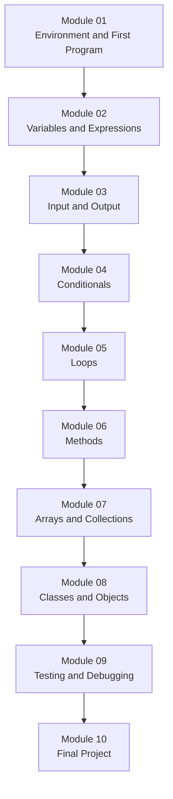

# Course Map — CSC 151 Java Programming I

This map shows a recommended topic sequence for a one-semester introductory Java course. The sequence is adaptable. Adjust the order, pacing, or scope to fit your institution's needs.

---

## Overview

*Each arrow represents a dependency. Students should complete earlier modules before later ones. Some instructors move Module 03 before Module 02 for motivational purposes; adjust as needed.*

---

## Module descriptions

### Module 01 — Environment and First Program

**Goal:** Students can set up a Java development environment, write a `HelloWorld` program, and run it successfully.

Topics:
- Installing or accessing a Java development environment (local or cloud-based).
- Writing a `public class` with a `main` method.
- Compiling and running from the command line or IDE.
- Reading error messages.

Suggested time: 1–2 class sessions.

---

### Module 02 — Variables and Expressions

**Goal:** Students can declare variables of primitive types, assign values, and evaluate arithmetic and string expressions.

Topics:
- Primitive types: `int`, `double`, `boolean`, `char`.
- Variable declaration and assignment.
- Arithmetic operators: `+`, `-`, `*`, `/`, `%`.
- Integer division and casting.
- String concatenation.
- `System.out.println` for output.

Sample lesson: [Module 01 in this repository](../modules/01-variables-expressions/lesson.md) covers this topic.

Suggested time: 2–3 class sessions.

---

### Module 03 — Input and Output

**Goal:** Students can read user input with `Scanner` and format output.

Topics:
- `import java.util.Scanner;`
- `System.in` and `Scanner` methods.
- `System.out.printf` for formatted output.
- Reading `int`, `double`, and `String` values.

Suggested time: 1–2 class sessions.

---

### Module 04 — Conditionals

**Goal:** Students can write `if`, `if-else`, and nested conditional statements to control program flow.

Topics:
- Boolean expressions and relational operators (`<`, `>`, `==`, `!=`, `<=`, `>=`).
- Logical operators: `&&`, `||`, `!`.
- `if`, `if-else`, `else if` chains.
- `switch` statement (introduce as an alternative to long `else if` chains).
- Common mistakes: using `=` instead of `==`.

Suggested time: 2–3 class sessions.

---

### Module 05 — Loops

**Goal:** Students can write `while`, `do-while`, and `for` loops and can choose the appropriate loop for a task.

Topics:
- `while` loop: condition checked before each iteration.
- `do-while` loop: condition checked after each iteration.
- `for` loop: init, condition, update.
- Loop variable tracing.
- `break` and `continue`.
- Nested loops.
- Common mistakes: off-by-one errors, infinite loops.

Suggested time: 3–4 class sessions.

---

### Module 06 — Methods

**Goal:** Students can write and call methods with parameters and return values, and can explain the call stack.

Topics:
- Defining methods: access modifier, return type, name, parameters.
- Return values and `void`.
- Method calls and argument passing.
- Scope of variables.
- Method overloading.
- Recursive methods (introduce carefully; reserve deep recursion for a later course).

Suggested time: 3–4 class sessions.

---

### Module 07 — Arrays and Collections

**Goal:** Students can declare, initialize, traverse, and manipulate arrays. Students can use `ArrayList` for a dynamically-sized collection.

Topics:
- Array declaration and initialization.
- Index-based access.
- `for` loop and enhanced `for` loop traversal.
- Common array algorithms: find max, find min, compute sum, count elements.
- Two-dimensional arrays (brief introduction).
- `java.util.ArrayList`: add, get, size, remove.

Sample lesson: [Module 02 in this repository](../modules/02-arrays/lesson.md) covers arrays.

Suggested time: 3–4 class sessions.

---

### Module 08 — Classes and Objects

**Goal:** Students can write a simple class with fields, a constructor, and methods, and can create and use objects.

Topics:
- Fields (instance variables) and access modifiers.
- Constructors.
- Getters and setters.
- `this` keyword.
- Creating objects with `new`.
- The difference between a class and an object.
- `toString` method.

Suggested time: 4–5 class sessions.

---

### Module 09 — Testing and Debugging

**Goal:** Students can write unit tests, read error messages, and use a systematic debugging process.

Topics:
- Types of errors: compile-time, runtime, logic.
- Reading stack traces.
- Using `System.out.println` for tracing.
- Writing simple unit tests with JUnit 5 or a lightweight test method.
- Normal, boundary, and failure test cases.
- Debugging strategy: reproduce, isolate, fix, verify.

Suggested time: 2–3 class sessions.

---

### Module 10 — Final Project

**Goal:** Students complete an original program of their own design that demonstrates the course skills.

Requirements (adapt as needed):
- The program must use at least one class, one array or collection, and at least one method beyond `main`.
- The program must compile and run.
- The student must submit a prediction of the output for at least two test cases.
- The student must complete the execute-gate handshake with the instructor before the final submission.
- The student must explain their design decisions in a short written or oral reflection.

Suggested time: 1–2 weeks.

---

## Adaptation notes

- **Slower pace:** Split each module into two or three shorter meetings. Add more trace-and-predict exercises before the coding task.
- **Faster pace:** Combine Modules 01 and 02, or combine Modules 03 and 04. Do not skip the execute gate or the transfer task.
- **Online or hybrid delivery:** The coach/player model works in breakout rooms, shared code editors, and asynchronous discussion boards. Adjust the handshake to the medium.
- **Dual enrollment or advanced students:** Add a Module 11 covering inheritance, interfaces, or file I/O. Keep Module 10 (final project) as the integrative capstone.

---

## Prerequisites

This course assumes students can:

- Use a keyboard and navigate files on a computer.
- Read and follow written instructions.
- Attempt a task and describe what happened.

This course does not assume prior programming experience.
