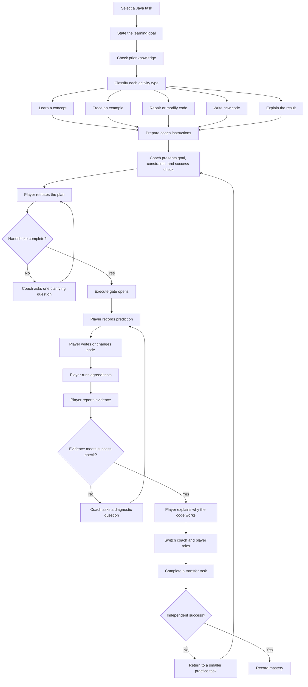
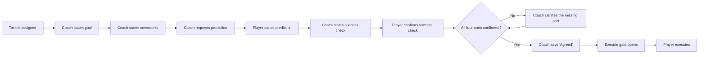
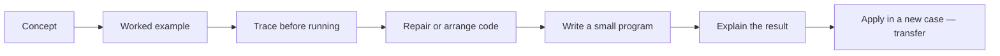

# Workflow Diagrams — CSC 151 Java Programming I

This page contains the primary Mermaid diagrams for the course workflow. Each diagram is followed by a plain-text description for screen readers and other assistive contexts.

---

## 1. Overall learning workflow

The diagram below shows the complete path from selecting a task to recording mastery.

**Plain-text description:**  
A task is selected and its learning goal is stated. Prior knowledge is checked. Each activity in the lesson is classified as learn, trace, repair, build, or explain. The coach prepares instructions and presents the goal, constraints, and success check to the player. The player restates the plan. If the handshake is incomplete, the coach asks one clarifying question and the player tries again. When the handshake is complete, the execute gate opens. The player records a prediction, writes or changes code, runs tests, and reports evidence. If the evidence does not meet the success check, the coach asks a diagnostic question and the player tries again. When the evidence meets the check, the player explains why the code works. The roles switch. The player (now acting as player with the former player as coach) completes a transfer task. If the transfer succeeds, mastery is recorded. If not, the pair returns to a smaller practice task.

---

## 2. Execute-gate handshake

The diagram below shows the four-part handshake that opens the execute gate.

**Plain-text description:**  
The task is assigned. The coach states the goal, then the constraints, then asks for a prediction. The player states their prediction. The coach states the success check, and the player confirms it. If all four parts (goal, constraints, prediction, success check) are confirmed, the coach says "Agreed" and the gate opens. If any part is missing, the coach clarifies and the check repeats. Once the gate opens, the player executes.

---

## 3. Lesson progression

The diagram below shows how a single lesson moves from concept to transfer.

```mermaid
flowchart LR
    A[State learning goal] --> B[Check prior knowledge]
    B --> C[Explain concept]
    C --> D[Worked example]
    D --> E[Trace before running]
    E --> F[Repair or arrange code]
    F --> G[Small coding task]
    G --> H[Run tests and record evidence]
    H --> I[Explain the result]
    I --> J[Switch roles]
    J --> K[Transfer task]
    K --> L[Reflect and record mastery]
```

**Plain-text description:**  
A lesson begins by stating the learning goal and checking what the student already knows. The concept is explained, followed by a worked example. The student traces the example before running it. The student then repairs or arranges provided code. Next, the student completes a small coding task, runs tests, and records evidence. The student explains the result. Roles switch (coach and player trade places). The student completes a transfer task with a changed condition. The lesson closes with reflection and a mastery record.

---

## 4. Assignment-shape summary

This diagram summarizes the activity types in a well-formed assignment.

**Plain-text description:**  
An assignment moves in order through: introducing a concept, showing a worked example, tracing before running, repairing or arranging provided code, writing a small program, explaining the result, and applying the concept in a new case (the transfer task).

---

## Notes on Mermaid diagrams

These diagrams use GitHub-flavored Mermaid. They render automatically in GitHub's Markdown preview. If you are viewing this file in a plain text editor or a system that does not render Mermaid, refer to the plain-text descriptions above each diagram.

All Mermaid blocks in this repository use the `flowchart` directive (not `graph`), which is the current recommended syntax for GitHub rendering.
