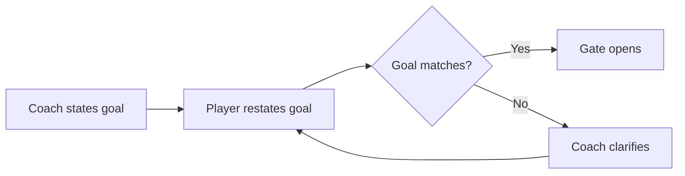
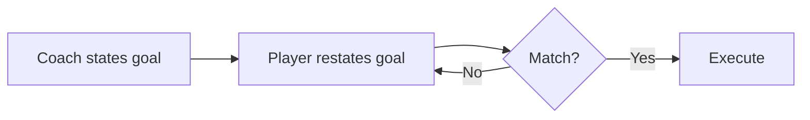
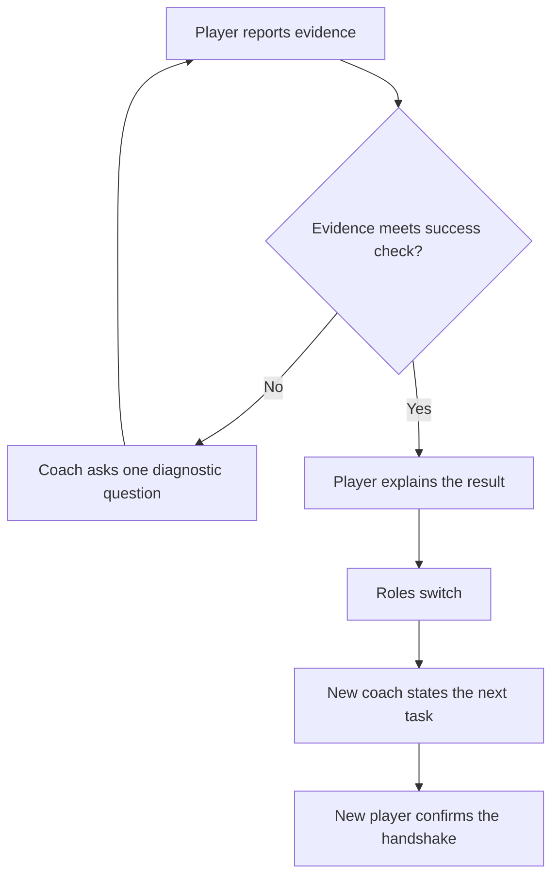

# Lesson 0.1: Technical Writing, Markdown, and Mermaid

**Module:** 0 — Getting on The Bus (submodule 0.1)
**Estimated time:** 60–90 minutes
**Prerequisites:** None.

---

## Learning goal

After this lesson, you can:

- Apply three STE-100 rules to improve a sentence.
- Format a task description in Markdown: headers, bold text, a numbered list, a code block, and a checklist.
- Read and write a Mermaid flowchart that diagrams a handshake.

---

## Prior knowledge check

Before starting, confirm you can do the following:

- [ ] Open and edit a plain-text file on your computer.
- [ ] View a Markdown file in a browser (for example, on GitHub).

If you cannot do both of these, ask your coach before continuing.

---

## Concept explanation

This lesson teaches three tools in one pass. STE-100 governs the sentences you write. Markdown
formats those sentences so a reader can scan them. Mermaid turns a sequence of steps into a
diagram. Each part below covers one tool.

### Part 1: Simplified Technical English

#### What is STE-100?

**Simplified Technical English (STE)** is a writing standard for technical documents. It makes instructions clear for readers who are not native English speakers and for readers who must act on what they read.

The full standard has over 60 rules. This lesson covers the three most useful rules for writing code tasks and course materials.

#### Rule 1: Use active voice.

In **active voice**, the subject does the action.

| Passive (avoid) | Active (use) |
|----------------|-------------|
| The gate is opened by the coach. | The coach opens the gate. |
| An error was found in the code. | The player found an error. |
| The array is returned by the method. | The method returns the array. |

Active sentences are shorter. They name the actor first.

#### Rule 2: Use one topic per sentence.

Each sentence states one idea. If a sentence contains "and" or "but" and can be split, split it.

| Compound (avoid) | Separated (use) |
|-----------------|----------------|
| State your prediction and then wait for the coach to approve it. | State your prediction. Wait for the coach to approve it. |
| Write the code and run it and record the output. | Write the code. Run it. Record the output. |

#### Rule 3: Use the same term for the same thing.

Do not use synonyms for technical terms. Choose one word and use it throughout.

| Inconsistent (avoid) | Consistent (use) |
|---------------------|-----------------|
| Complete the handshake. Confirm the handoff. | Confirm the handshake. |
| The student executes the program. Later, the learner runs the code. | The player executes the code. |

In this course, the structured agreement before execution is called the **handshake**. Use that term every time.

---

### Part 2: Markdown

#### What is Markdown?

**Markdown** is a plain-text formatting syntax. You write plain characters and they display as formatted text. GitHub renders Markdown automatically in `.md` files.

#### Basic syntax

##### Headers

```markdown
# Level 1 header — page title
## Level 2 header — section
### Level 3 header — sub-section
```

Use one `#` for the page title. Use `##` for major sections. Use `###` for sub-sections.

##### Bold and italic

```markdown
**bold text**
*italic text*
```

Use **bold** for terms you are defining and for steps the reader must take. Use *italic* sparingly — for titles and for a term's first use when you will define it immediately after.

##### Inline code and code blocks

Use backticks for short code: `int count = 0;`

Use triple backticks with a language tag for blocks:

````markdown
```java
public class Hello {
    public static void main(String[] args) {
        System.out.println("Hello");
    }
}
```
````

##### Lists

Unordered list:
```markdown
- Item one
- Item two
- Item three
```

Ordered list:
```markdown
1. First step
2. Second step
3. Third step
```

Checklist (task list):
```markdown
- [ ] Not done
- [x] Done
```

##### Tables

```markdown
| Column A | Column B |
|----------|----------|
| Row 1A   | Row 1B   |
| Row 2A   | Row 2B   |
```

---

### Part 3: Mermaid — How to Diagram a Play

#### What is Mermaid?

**Mermaid** is a diagram-as-code tool. You write a text description and Mermaid renders it as a visual diagram. GitHub renders Mermaid inside a fenced code block with the tag `mermaid`.

#### What is a play diagram?

In team sports, a **play diagram** shows each actor's position and the sequence of actions in a planned play. It makes a plan visible before the play starts.

In this course, a Mermaid flowchart serves the same purpose: it makes the steps and decisions in a handshake visible so that every participant understands the plan before execution begins. Diagramming a play means drawing the sequence of actions and decisions so that no step is assumed or skipped.

#### Flowchart basics

A Mermaid flowchart starts with `flowchart` followed by a direction:

- `TD` — top-down
- `LR` — left-right

##### Node shapes

```
A[Rectangular node]       — a step or action
B(Rounded node)           — a start or end point
C{Diamond node}           — a decision
```

##### Arrows

```
A --> B                   plain arrow
A -- label --> B          arrow with a label
```

##### A short example



**Plain-text description:**
The coach states the goal. The player restates it. If the restatement matches, the gate opens. If not, the coach clarifies and the player tries again.

#### Diagramming the handshake

The **handshake** is the four-part agreement before execution. The canonical play diagram for the handshake is in [docs/workflow-diagrams.md](../../docs/workflow-diagrams.md).

For this exercise, use the diagram in that file as your reference. Read it before continuing.

---

## Worked example

The following is a task description written in plain prose, then rewritten using STE rules and formatted in Markdown.

**Original (before):**

> Students should look at the code and they need to figure out what it does and write down what they think will happen when it gets executed and then they can run it.

**After applying STE rules:**

> Read the code. Do not run it yet. Write your prediction: what will the output be? After you write your prediction, run the code.

**Formatted in Markdown:**

```markdown
**Task:** Read the code. Do not run it yet.

1. Write your prediction: what will the output be?
2. Run the code.
3. Compare your prediction to the actual output.
```

**What changed:**

- Passive → active: "Students should look at" → "Read."
- One topic per sentence: the compound sentence is split into three steps.
- Consistent terms: "prediction" is used as the single term for the expected result.

---

## Trace before running

*In this lesson the thing you trace is a passage of prose rather than a program. You read it,
predict what is wrong with it, and only then check.*

**Task:** Read the following passage. Do not evaluate it yet. Write your answers to the questions below. Then open the answers.

> Before you start coding, the goal and constraints are confirmed by the coach, and then the student writes a prediction and it is checked by the coach, and then the student runs the code.

**Questions — write your answers before opening the answers:**

1. Which STE rules does this passage break? Name each one.
2. Rewrite the passage in active voice.
3. Split the passage so that each sentence contains one topic.

<details>
<summary>Answers — open only after writing your own</summary>

**Violations:**
1. Passive voice (Rule 1): "are confirmed by the coach," "is checked by the coach."
2. Compound sentences (Rule 2): multiple actions are joined with "and."

**Rewritten:**

> Confirm the goal and constraints with the coach. Write your prediction. The coach reviews your prediction. Execute the code.

Or as a numbered list:
1. Confirm the goal and constraints with the coach.
2. Write your prediction.
3. The coach reviews your prediction.
4. Execute the code.

</details>

---

## Repair code

*The code you repair here is Mermaid source. Mermaid is diagram-as-code, so a diagram carries
syntax errors and logic errors exactly as a Java program does.*

The following Mermaid source has two errors. Find them and fix them. Do not render the diagram until you have written your explanations.

```
flowchart LR
    A[Coach states goal] --> B[Player restates goal]
    B --> C{Match?
    C -- Yes --> D[Execute]
    C -- No --> A
```

**Errors to find:**

1. There is a syntax error on line 3.
2. There is a logic error: the "No" branch loops to the wrong node.

Write your explanation for each fix before checking.

<details>
<summary>Corrections — open only after writing your explanations</summary>

1. `C{Match?` is missing the closing `}`. Fix: `C{Match?}`.
2. When the player's restatement does not match, the process should return to the player's step (`B`), not to the coach's first statement (`A`). Fix: `C -- No --> B`.

Corrected diagram:



**Plain-text description:**
The coach states the goal. The player restates the goal. A decision asks whether the two match.
If they match, the player executes. If they do not match, the flow returns to the player's
restatement.

</details>

---

## Execute-gate handshake

You are now going to write a Markdown task card and a Mermaid diagram. Complete the handshake with your coach before writing anything.

**Coach provides this task:**

> Write a Markdown-formatted task card for a classmate. The card must describe the handshake process in three numbered steps using STE rules. Each step must be one sentence in active voice. Then add a Mermaid flowchart that diagrams those three steps. The diagram must include at least one decision node.
>
> Constraints: Each sentence must be in active voice. You may use only the three steps you name in your list. You may not describe more or fewer than three steps.

**Player: complete the handshake using this format:**

```
Goal: The task card must ______.
Constraints: I may ______. I may not ______.
Prediction: The card will contain ______.
Success check: We know it works when ______.
```

**Gate opens when the coach says: "Agreed."**

---

## Small coding task

*The code you write here is Markdown and Mermaid source rather than Java. You write source
text, render it, and check what it produced — the same cycle every later lesson uses.*

Write a Markdown file that contains:

1. A level-2 header: `## Handshake steps`
2. A numbered list of three steps describing the handshake in STE language.
3. A Mermaid flowchart of those three steps, with at least one decision node.
4. A plain-text description of the diagram (one sentence per node or edge).

**Requirements:**

- Every sentence is in active voice.
- Each step is one sentence.
- The same term is used for the same concept throughout.
- The Mermaid diagram renders without syntax errors in GitHub preview.

---

## Test evidence

Evidence in this course has three tiers, and you record all three every time. **Normal** is the
case the work was built for. **Boundary** is the smallest or largest case it still has to
handle. **Failure** is the case that breaks it, recorded so you know what the break looks like.

| Tier | What to do | Expected | Actual | Match? |
|------|-----------|----------|--------|--------|
| **Normal** | Preview your finished file in GitHub | Headers, list, and diagram all render | | |
| **Boundary** | Count the decision nodes in your diagram | Exactly one `{diamond}` node, the fewest the task allows | | |
| **Failure** | Delete the closing `}` from that decision node, preview again, then restore it | GitHub reports a parse error and shows no diagram at all | | |

The failure tier is the one worth your attention. A Mermaid diagram does not render partially.
One missing brace removes the whole diagram, which is why the repair exercise above starts with
a missing brace.

Then check each item:

| Check | Criterion | Met? |
|-------|-----------|------|
| Active voice | No sentence uses passive voice. | |
| One topic per sentence | No sentence joins two actions with "and." | |
| Consistent terms | The same word names the same concept throughout. | |
| Markdown renders | Headers, list, and code block display correctly. | |
| Mermaid renders | Diagram displays without error in GitHub preview. | |
| Decision node present | The diagram contains at least one `{diamond}` node. | |
| Plain-text description | Every node and decision has a written description. | |

---

## Explanation

Answer these questions in writing or out loud to your coach:

1. Which STE rule was hardest to apply? Why?
2. What does the decision node in your diagram represent?
3. How is a play diagram useful before a play starts? How does a Mermaid diagram serve the same purpose?
4. What evidence shows your diagram matches your written steps?

---

## Role rotation

Switch roles with your partner. The new coach describes the transfer task. The new player restates the plan and completes the handshake before writing.

---

## Transfer task

**Changed condition:** Instead of diagramming the handshake, diagram the **role rotation** — what happens after the player completes a task and roles switch.

**Coach provides this task:**

> Write a Mermaid flowchart that diagrams the role rotation after a player completes a task. Include at least one decision node. Write a plain-text description of the diagram. Use STE rules in all text nodes: active voice, one topic per label.

**Player: complete the full handshake before writing.**

<details>
<summary>Example diagram (check only after completing your own)</summary>



**Plain-text description:**
The player reports evidence. If the evidence does not meet the success check, the coach asks one diagnostic question and the player tries again. When the evidence passes, the player explains the result. Roles switch. The new coach states the next task. The new player confirms the handshake.

</details>

---

## Reflection

Answer one of the following:

- Why does STE require one topic per sentence? What does a compound sentence hide from the reader?
- How is a Mermaid diagram similar to a football play diagram? How are they different?
- Which of the three skills in this lesson — STE, Markdown, Mermaid — will be most useful in your code documentation? Why?

---

## Mastery record

| Skill | Not yet | Developing | Secure |
|-------|---------|------------|--------|
| Apply active voice (STE Rule 1) | | | |
| Write one topic per sentence (STE Rule 2) | | | |
| Use consistent terms (STE Rule 3) | | | |
| Format a task card in Markdown | | | |
| Write a Mermaid flowchart that renders | | | |
| Include a decision node in a diagram | | | |
| Write a plain-text description of a diagram | | | |
| Complete the execute-gate handshake | | | |
| Explain the result with evidence | | | |
| Coach role completed | | | |
| Transfer task completed independently | | | |
