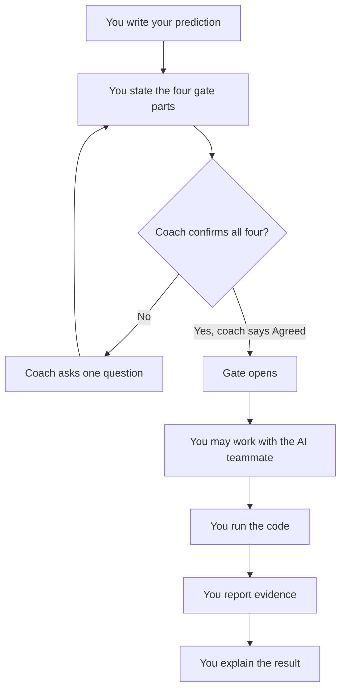

# Lesson 0.3: Work Surfaces and Your AI Teammate

**Module:** 0 — Getting on The Bus (submodule 0.2)  
**Estimated time:** 50–75 minutes  
**Prerequisites:** Lesson 0.2. You can compile and run a Java program.

---

## Learning goal

After this lesson, you can:

- Name your work surface and run the course verifier on it.
- State what is the same on both work surfaces, and what differs.
- State the five rules for working with an AI teammate.
- Write a request that another party can act on without asking you a question back.
- Disclose what an AI teammate produced, what you changed, and what you kept.
- Answer one diagnostic question about any line you submit.

---

## Prior knowledge check

Before starting, confirm you can do the following:

- [ ] Compile and run `HelloWorld.java` on the surface you plan to use.
- [ ] State the four parts of the execute-gate handshake from memory.
- [ ] Open a terminal and run a command in it.

If you cannot do all three, return to Lesson 0.2 before continuing.

---

## Concept explanation

### Your two work surfaces

A **work surface** is where you write and run code. This course supports two.

| | GitHub Codespace | Local VS Code |
|---|---|---|
| Where it runs | On a server, in your browser | On your own computer |
| Setup | None. It is ready when it opens. | You install a JDK and the VS Code Java extension. |
| Needs an internet connection | Yes, always | Only to push your work |
| Has a graphical display | No | Yes |
| Runs `bash scripts/verify.sh all` | Yes | Yes |

**Every graded task in this course runs on either surface.** That is a promise, not an
estimate. Where a task could have required a display, it was designed so that it does not.

The one difference that reaches your work is the display. A Codespace has no screen for a
program to draw on, so a program that opens a window cannot run there. In Module 8 you will
process a user event as a function call. You may do that by selecting an option from a
console menu, which runs on both surfaces, or — if you work locally — by pressing a button in
a window. **Both count fully.** The console version is not a reduced version of the
assignment, and choosing it costs you nothing.

### The verifier settles disagreements

Two students on two surfaces will sometimes disagree about what a program prints. One command
settles it:

```
bash scripts/verify.sh all
```

The verifier compiles every example, runs it, and compares what it actually printed against
what the course recorded that it should print. It reports PASS or FAIL per file.

Run it on your own surface before you ask for help. "It does not work" starts a conversation.
"`verify.sh` says FAIL on `ScannerDemo`, and here is the diff" starts a fix.

### What an AI teammate is in this course

You may use an AI coding assistant. This is stated plainly so that nobody has to guess:
using one is allowed, and hiding that you used one is not. The full rules are in the
[AI Teammate Policy](../../docs/ai-teammate-policy.md), and this lesson is where you practice them.

The model is the same coach and player model you already know. **The AI can be the player.
You are the coach.** The player writes code. The coach states the goal, guards the gate, asks
questions, and requests evidence.

You may hand the player role to an AI. You may not hand over the coach role. A coach who
cannot evaluate a player's work is not coaching.

### The five rules

| # | Rule | What it looks like when you follow it |
|---|------|--------------------------------------|
| 1 | The AI may be the player. You must be the coach. | You state the goal. You judge the result. |
| 2 | The AI may never open the execute gate. | Only a person says "Agreed." |
| 3 | Predict before you run, every time. | Your prediction is written before you ask for anything. |
| 4 | Disclose what the AI produced. | Your record names what it wrote, what you changed, what you kept. |
| 5 | You must be able to explain any line you submit. | Your coach points at a line. You answer. |

**Rule 2 is the one students ask about, so here is the reason.** The gate exists so that two
parties confirm a shared understanding before code runs. An AI agreeing with you confirms
nothing about your understanding — it confirms that you asked it. The gate is a handshake
between you and a human coach. That is what makes it evidence.

### Where the AI fits in the handshake



**Plain-text description:** You write your prediction first, before anything else happens.
You then state the four gate parts to your coach. If the coach does not confirm all four, the
coach asks one question and you state the parts again. When the coach says "Agreed," the gate
opens. Only after the gate opens may you work with the AI teammate. You then run the code,
report the evidence, and explain the result. The prediction step and the gate both come before
the AI does anything, and the evidence and explanation are yours.

### Asking for the shortest thing that could work

A request works when the reader can act on it without asking you a question back. Test any
request against the same four items as the gate:

| Floor item | The question it answers |
|------------|------------------------|
| **Goal** | What must the code do? |
| **Constraints** | What may change, and what may not? |
| **Prediction** | What do I expect to happen? |
| **Success check** | How will we know it worked? |

A request that clears all four is ready. A request missing one produces a confident answer to
a question you did not ask, which costs more time than writing the request carefully.

This test works on a request to an AI teammate, a request to your coach, and a question you
post for a classmate. It is the same instrument every time.

[Prompting Your AI Teammate](../../docs/prompting-your-ai-teammate.md) works through the test
in more depth, with more examples than this lesson has room for.

---

## Worked example

A student wants a method that returns the larger of two integers.

**First attempt at the request:**

> Write me a Java max function.

Run the floor test on it.

| Floor item | Present? | What is missing |
|------------|----------|-----------------|
| Goal | Partly | "Max" of what? Two values, or an array? |
| Constraints | No | May it use `Math.max`? Is it static? |
| Prediction | No | Nothing stated |
| Success check | No | Nothing stated |

One of four. The student would receive something plausible and would then spend longer
checking whether it matched the assignment than writing the request would have taken.

**Second attempt:**

> Write a `public static int larger(int a, int b)` that returns the larger of its two
> parameters. Do not call `Math.max` — the point is to write the comparison. When both
> arguments are equal, return that value. I predict `larger(3, 7)` returns `7` and
> `larger(4, 4)` returns `4`. I will check it by calling it with those two pairs and one pair
> of negative numbers.

| Floor item | Present? |
|------------|----------|
| Goal | Yes — named method, named signature, stated behavior |
| Constraints | Yes — no `Math.max`, and the equal case is specified |
| Prediction | Yes — two concrete expected values |
| Success check | Yes — three named test calls |

Four of four. Notice what the second version cost: about forty seconds. Notice what it
bought: the student wrote the prediction, so if the returned code does something else, the
student notices immediately.

**What the student records on the coach/player record:**

> The AI wrote the `if` statement and the return. I changed the parameter names from `x` and
> `y` to `a` and `b` to match the assignment. I kept everything else. I added the negative
> test case myself.

That is a complete disclosure. It took one sentence.

---

## Trace before running

A student sends this request to an AI teammate:

> My program prints the wrong number. Fix it.

**Predict:** which of the four floor items are present, and what is the first thing the
reader must ask before it can act?

Write your prediction before you look.

<details>
<summary>Answer</summary>

**Zero of four are present.**

- **Goal:** absent. "The wrong number" does not say what the right number is.
- **Constraints:** absent. Nothing states which file, or what may change.
- **Prediction:** absent. No expected output is given.
- **Success check:** absent. No way to tell when it is fixed.

The first thing the reader must ask is: **"What number did it print, and what number did you
expect?"** Everything else follows from those two values.

This request has a second problem. It asks the reader to fix the program, so the student has
handed over the coach role, not the player role. A version that keeps the coach role reads:
"`Average.java` prints `1` for the input 1 and 2. I expected `1.5`. What in the calculation
produces a whole number?" That version asks for a diagnosis, and the student still decides
what to change.
</details>

---

## Repair code

The following request is broken. It fails on exactly one floor item.

> In `Greeting.java`, change the `greet` method so it returns `"Hello, "` followed by the
> `name` parameter. Do not change the method signature. I will check it by calling
> `greet("Sam")`.

**Your task:** name the missing item, then rewrite the request so that it clears all four.
Change as little as possible.

<details>
<summary>Answer</summary>

**The missing item is the prediction.** The request names a test call but never says what
that call should return, so there is nothing to be surprised by.

The repair adds one clause:

> In `Greeting.java`, change the `greet` method so it returns `"Hello, "` followed by the
> `name` parameter. Do not change the method signature. **I predict `greet("Sam")` returns
> `Hello, Sam`.** I will check it by calling `greet("Sam")`.

Eight words. This is the item most often missing from a first draft, and it is the one that
matters most, because the prediction is the only part that can be wrong in a way that teaches
you something.

**A note on the check itself:** `greet("Sam")` is a normal case. Before you submit, ask what
`greet("")` should return. That is the boundary case, and it is where the interesting
question lives.
</details>

---

## Execute-gate handshake

Complete this handshake with your coach before you write the coding task below.

| Part | You state |
|------|-----------|
| **Goal** | "The program must print my name and the work surface I am using." |
| **Constraints** | "I may change `main`. I may not change the class name. I will use an AI teammate for [WHICH PART], or for no part." |
| **Prediction** | "I expect the output to be exactly: ______" |
| **Success check** | "We know it works when the program compiles and prints those two lines, and when I can answer one question about any line." |

The gate opens when your coach says **"Agreed."** Your AI teammate does not open it, and
neither does your own confidence that you are ready.

---

## Small coding task

Write `Surface.java`. The program prints two lines: your name, and the name of the work
surface you are using.

**Requirements:**

1. The class is named `Surface` and the file is named `Surface.java`.
2. The program prints your name on the first line.
3. The program prints either `Codespace` or `Local` on the second line.
4. The second line comes from a `String` variable, not from a literal inside `println`.

**You may use an AI teammate for any part of this.** If you do, write the request first, run
the floor test on it, and record the disclosure on your
[coach/player record](../../templates/coach-player-record.md). If you do not, write
"No AI teammate used" on that record. Both answers are complete answers.

**Before you write the request, write your prediction.** Rule 3 has no exceptions, and this
task is short enough that skipping the prediction saves you almost nothing.

---

## Test evidence

Record all three tiers.

| Tier | What to run | What you observed |
|------|-------------|-------------------|
| **Normal** | Run the program as written | ______ |
| **Boundary** | Set the surface variable to an empty string and run it again | ______ |
| **Failure** | Rename the file to `surface.java` and compile it | ______ |

The failure tier is the one worth your attention. Java requires the file name to match the
public class name, so the compiler refuses before the program ever runs. Record the exact
error text. You have now seen it deliberately, which means the next time you see it by
accident you will recognize it. The [FAQ](../../docs/faq.md) lists the ten errors you are most
likely to meet first, and this is one of them.

---

## Explanation

Answer in writing, in your own words:

1. Which line assigns the surface name to a variable, and what would change if you deleted
   that line?
2. Why does the boundary case still compile and run, when the failure case does not?
3. If you used an AI teammate: point at one line it produced and state what that line does.
   If you did not: point at one line you wrote and do the same.

Question 3 is the diagnostic question, and it is the whole enforcement mechanism of the AI
policy. Your coach will ask you one of these on every submission this term. A student who
used the tool well answers it in about ten seconds.

---

## Role rotation

Hand off the roles. The **handoff** is the role switch that happens now that the task is
complete. It is not a handshake — a handshake is the four-part agreement that opened the gate.
The two words name different things in this course.

The new coach does two things:

1. Ask the new player one diagnostic question about the player's `Surface.java`.
2. Read the player's disclosure aloud, and ask whether it names all three parts: what the AI
   wrote, what the player changed, and what the player kept.

If the disclosure names fewer than three, ask for the missing part. Do not ask the player to
prove they did not use a tool. That standard cannot be met, and it punishes honest people.
Ask what the work does.

---

## Transfer task

Take a classmate's request from the coding task above — the one they sent to their AI
teammate, or the one they would have sent.

**Run the floor test on it and report what survives.** Report only. Do not rewrite it.

| Floor item | Present in their request? | What a reader must ask |
|------------|--------------------------|------------------------|
| Goal | ☐ | ______ |
| Constraints | ☐ | ______ |
| Prediction | ☐ | ______ |
| Success check | ☐ | ______ |

End your report with one sentence naming the single most useful item to add.

Reporting is not rewriting. Handing back a repaired request takes the work away from the
person who needs the practice. Hand back the finding and let them repair it.

---

## Reflection

Answer in two or three sentences each:

1. Which work surface did you choose, and what would make you switch?
2. Rule 3 says predict before you run, every time. Name one moment in this lesson when
   skipping the prediction would have been faster, and state what you would have lost.
3. The policy says the bus is the process, not the tooling. In your own words, what would it
   take to use an AI teammate for every line of an assignment and still be on the bus?

> **"You are either on the bus or off the bus."**
>
> **Literal meaning:** the bus is the course process — predict, complete the handshake,
> execute, report evidence, explain the result. The phrase comes from American team sports,
> where the team bus leaves on schedule and everyone travelling is aboard. You do not need to
> know anything about sports to take this course.
>
> Using an AI teammate and completing every step is on the bus. Writing every line by hand
> and skipping the prediction is off the bus. The tool is not the question.

---

## Mastery record

| Skill | Not yet | Developing | Mastered |
|-------|---------|-----------|----------|
| I can run the verifier on my work surface and read its output | ☐ | ☐ | ☐ |
| I can state what differs between the two surfaces | ☐ | ☐ | ☐ |
| I can state the five AI teammate rules | ☐ | ☐ | ☐ |
| I can write a request that clears all four floor items | ☐ | ☐ | ☐ |
| I can run the floor test on someone else's request and report it | ☐ | ☐ | ☐ |
| I can disclose AI use in one sentence naming all three parts | ☐ | ☐ | ☐ |
| I can answer a diagnostic question about any line I submit | ☐ | ☐ | ☐ |
| I completed the handshake before writing code | ☐ | ☐ | ☐ |
