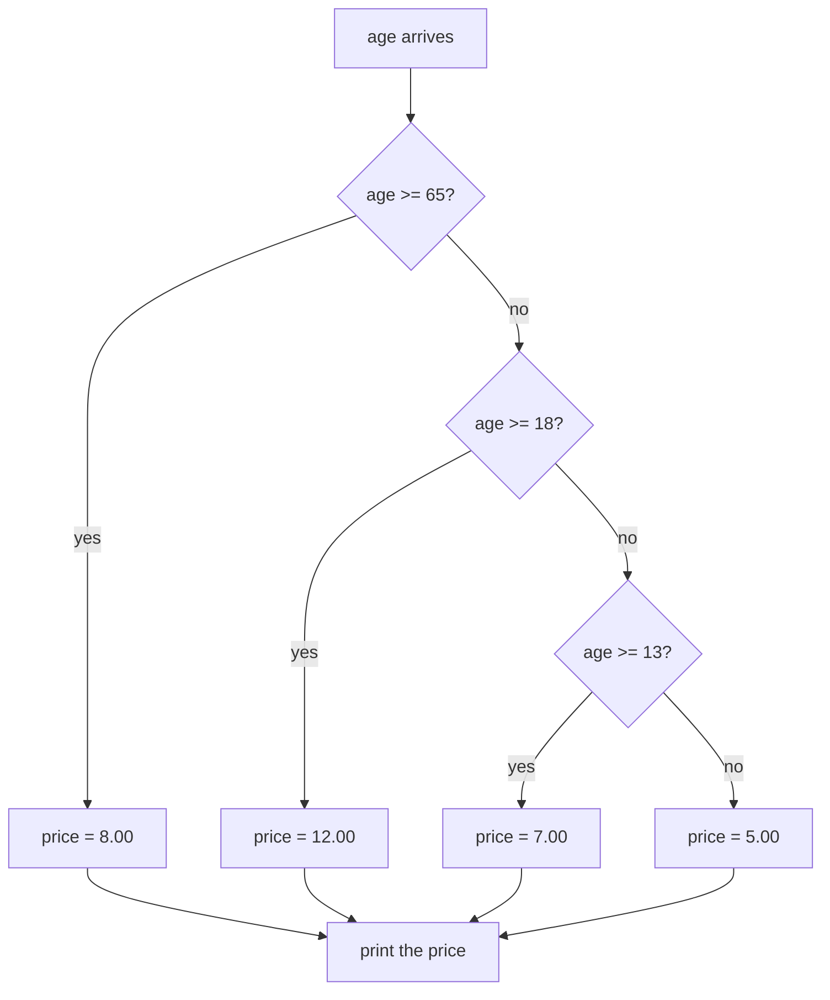

# Lesson 3: Conditionals

**Module:** 3 — Conditionals  
**Estimated time:** 75–100 minutes  
**Prerequisites:** You can declare `int`, `double`, and `String` variables. You can read a value with `Scanner` and print a formatted line with `printf`.

---

## Learning goal

After this lesson, you can:

- Write a boolean expression using the relational operators `<`, `>`, `==`, `!=`, `<=`, and `>=`.
- Combine two conditions with `&&`, `||`, and `!`.
- Write an `else if` chain that tests bands from the highest band down.
- Choose between an `else if` chain and a `switch` for the same decision.
- Compare two `String` values with `.equals` and state what `==` asks instead.

---

## Prior knowledge check

Before starting, confirm you can do the following:

- [ ] Declare an `int`, a `double`, and a `String`, and assign a value to each.
- [ ] Read an `int`, a `double`, and a word from the user with `Scanner`.
- [ ] Print a value to two decimal places with `System.out.printf`.

If you cannot do all three, complete Module 2 (Input and Output) before continuing.

---

## Concept explanation

### A condition is a question with a yes-or-no answer

A **condition** is an expression that produces `true` or `false`. Java calls that a `boolean`
value, and you met the type in Module 1. A conditional statement runs one block of code when
the condition is `true` and skips it when the condition is `false`.

### Relational operators

These six operators compare two numbers and produce a `boolean`.

| Operator | Question it asks | Example with `age = 30` | Result |
|----------|-----------------|------------------------|--------|
| `<` | Is the left value less than the right value? | `age < 18` | `false` |
| `>` | Is the left value greater than the right value? | `age > 18` | `true` |
| `<=` | Less than **or equal to**? | `age <= 30` | `true` |
| `>=` | Greater than **or equal to**? | `age >= 30` | `true` |
| `==` | Are the two values equal? | `age == 30` | `true` |
| `!=` | Are the two values different? | `age != 30` | `false` |

`=` and `==` are different operators. `=` puts a value into a variable. `==` asks a question
and changes nothing. The [FAQ](../../docs/faq.md) lists this pair as error 2, because the two
symbols look alike and do unrelated jobs.

### Logical operators

Three operators combine or invert conditions.

| Operator | Name | The whole expression is `true` when |
|----------|------|------------------------------------|
| `&&` | and | Both parts are `true` |
| `\|\|` | or | At least one part is `true` |
| `!` | not | The part after it is `false` |

The full truth table for two conditions, `A` and `B`:

| `A` | `B` | `A && B` | `A \|\| B` | `!A` |
|-----|-----|----------|-----------|------|
| `true` | `true` | `true` | `true` | `false` |
| `true` | `false` | `false` | `true` | `false` |
| `false` | `true` | `false` | `true` | `true` |
| `false` | `false` | `false` | `false` | `true` |

**`&&` stops as soon as the answer is decided.** When the left part is `false`, the whole
expression is already `false`, so Java never evaluates the right part. This behavior has a
name — short-circuit evaluation — and it matters when you trace code. A trace that reports
"Java checked the membership here" is wrong if the part to its left was already `false`.

### `if`, `if-else`, and the `else if` chain

```java
if (weight >= 5.0) {
    System.out.println("Heavy");
}
```

```java
if (weight >= 5.0) {
    System.out.println("Heavy");
} else {
    System.out.println("Light");
}
```

An **`else if` chain** tests several conditions in order and runs the body of the first one
that is `true`. Every later test is skipped, whether or not it would also have been `true`.

```java
if (age >= 65) {
    price = 8.00;
} else if (age >= 18) {
    price = 12.00;
} else if (age >= 13) {
    price = 7.00;
} else {
    price = 5.00;
}
```

**The order of the chain is the design.** Read the three tests against an age of 70. All three
are `true`, and only the first one runs. Now write the same three tests in the other order —
`age >= 13` first — and every age from 13 upward matches that first test. The senior band and
the adult band become dead code: they are written, they compile, and control never reaches
them. The chain must run from the highest band down.



**Plain-text description:** An age arrives and reaches the first decision, which asks whether
the age is 65 or more. When the answer is yes, the price becomes 8.00 and control goes
straight to the printing step. When the answer is no, control reaches a second decision, which
asks whether the age is 18 or more; yes sets the price to 12.00, and no passes control to a
third decision. The third decision asks whether the age is 13 or more; yes sets the price to
7.00, and no sets the price to 5.00. All four price settings lead to the same printing step.
Each decision is reached only when every decision above it answered no.

### `switch` as an alternative to a long chain

When a chain tests one variable against a list of exact values, a `switch` states the same
decision with less repetition.

```java
switch (command) {
    case "list":
        action = "Listing every entry.";
        break;
    case "add":
        action = "Adding an entry.";
        break;
    default:
        action = "Unknown command: " + command;
}
```

Each `case` names one exact value. `default` catches everything the cases missed, and it does
the job the final `else` does in a chain.

**A `case` does not fall out on its own.** `break` ends the switch. Remove it and control runs
straight into the next case body, which overwrites the answer you just set.
`examples/MenuSwitch.java` makes the same decision twice, once with a `switch` and once with
an `else if` chain, and prints both answers so you can see them agree.

A `switch` fits an exact-match decision. It does not fit a band, because `case age >= 65` is
not legal Java. Keep the chain for ranges.

### Comparing two `String` values

Use `.equals` to ask whether two `String` values hold the same characters.

```java
if (member.equals("yes")) {
    price = 9.00;
}
```

`==` asks a different question. It asks whether two references point at **the same object**.
A word that `Scanner` read from the user is a new object built from the characters that
arrived, so it is never `==` to a literal written in your source, even when the two read the
same on screen.

```java
String typed = input.next();   // the user types: yes
typed == "yes"                 // false — two different objects
typed.equals("yes")            // true  — the same characters
```

This defect compiles without a warning and produces no error at run time. It produces a branch
that never runs. `examples/StringMatch.java` prints both answers side by side.

Key terms introduced in this lesson:

- **Condition:** an expression that produces `true` or `false`.
- **Branch:** one block of a conditional statement, run when its condition is `true`.
- **Short-circuit evaluation:** Java stops evaluating `&&` or `||` once the answer is decided.
- **Dead code:** a branch that compiles but that control can never reach.

---

## Worked example

`examples/TicketPrice.java` prints the ticket price for four fixed cases. Each case runs the
same `else if` chain over an age band, and one band also tests a membership flag with `&&`.
The abridged version below shows the first case and the last case. The full runnable file has
all four.

```java
// TicketPrice.java
// Prints the ticket price for four fixed cases.
// See examples/TicketPrice.java for the full runnable version.

public class TicketPrice {
    public static void main(String[] args) {

        // Case 1: a child who is not a member.
        int age = 12;
        String member = "no";
        double price;

        if (age >= 65) {
            price = 8.00;
        } else if (age >= 18 && member.equals("yes")) {
            price = 9.00;
        } else if (age >= 18) {
            price = 12.00;
        } else if (age >= 13) {
            price = 7.00;
        } else {
            price = 5.00;
        }
        System.out.printf("Age %d, member %s: $%.2f%n", age, member, price);

        // Case 4: an adult who is not a member. The same chain, new data.
        age = 30;
        member = "no";
        if (age >= 65) {
            price = 8.00;
        } else if (age >= 18 && member.equals("yes")) {
            price = 9.00;
        } else if (age >= 18) {
            price = 12.00;
        } else if (age >= 13) {
            price = 7.00;
        } else {
            price = 5.00;
        }
        System.out.printf("Age %d, member %s: $%.2f%n", age, member, price);
    }
}
```

**Expected output (from the full file, all four cases):**
```
Age 12, member no: $5.00
Age 70, member yes: $8.00
Age 30, member yes: $9.00
Age 30, member no: $12.00
```

**What to notice:**

- The chain runs from the highest band down. Written the other way, every case from age 13
  upward would match `age >= 13` and print `$7.00`.
- The member band sits **above** the plain adult band. A chain stops at its first `true` test,
  so the discounted price has to be offered before the full price is.
- Case 4 fails the `&&` on its right part, so control reaches the plain adult band below it.
  Case 3 passes both parts and stops one branch earlier.
- The chain is written out four times because every line of this program lives in `main`.
  Module 5 shows how to write a decision once and call it four times. The repetition here is
  the honest cost of the current toolkit.

**One common mistake:**

```java
} else if (age >= 18 && member == "yes") {   // WRONG for a word the user typed
```

This compiles. Against a `member` value that `Scanner` read, it is always `false`, so the
member price is never offered and no error appears anywhere.

---

## Trace before running

**Task:** Trace the chain in `examples/TicketPrice.java` for two of its four cases. Do not run
the file yet.

Fill in one row per test. Write `not reached` for any test the chain skipped.

**Case A — `age = 12`, `member = "no"`:**

| Test in the chain | `true`, `false`, or not reached | Notes |
|-------------------|-------------------------------|-------|
| `age >= 65` | ______ | |
| `age >= 18 && member.equals("yes")` | ______ | Which part of the `&&` was evaluated? |
| `age >= 18` | ______ | |
| `age >= 13` | ______ | |
| `else` | ______ | |

**Case B — `age = 70`, `member = "yes"`:**

| Test in the chain | `true`, `false`, or not reached | Notes |
|-------------------|-------------------------------|-------|
| `age >= 65` | ______ | |
| `age >= 18 && member.equals("yes")` | ______ | |
| `age >= 18` | ______ | |
| `age >= 13` | ______ | |
| `else` | ______ | |

**Prediction questions — write your answers before running:**

1. Which branch sets the price in Case A, and what is the printed line?
2. In Case A, does Java evaluate `member.equals("yes")`? State why.
3. Which branch sets the price in Case B, and what is the printed line?
4. In Case B the member is a member. Why does the `$9.00` member price not apply?

<details>
<summary>Answers — open only after filling in both tables and writing your predictions</summary>

**Case A — `age = 12`, `member = "no"`:**

| Test in the chain | Result |
|-------------------|--------|
| `age >= 65` | `false` |
| `age >= 18 && member.equals("yes")` | `false` — `age >= 18` is `false`, so the right part is never evaluated |
| `age >= 18` | `false` |
| `age >= 13` | `false` |
| `else` | runs — `price = 5.00` |

**Case B — `age = 70`, `member = "yes"`:**

| Test in the chain | Result |
|-------------------|--------|
| `age >= 65` | `true` — `price = 8.00` |
| `age >= 18 && member.equals("yes")` | not reached |
| `age >= 18` | not reached |
| `age >= 13` | not reached |
| `else` | not reached |

1. The final `else` sets the price. The line is `Age 12, member no: $5.00`.
2. No. `&&` stops as soon as the answer is decided. `age >= 18` is `false` for an age of 12,
   so the whole expression is already `false` and the `.equals` call never runs.
3. The first branch sets the price. The line is `Age 70, member yes: $8.00`.
4. The chain runs the body of the **first** `true` test and skips every later one. `age >= 65`
   is `true`, so the chain ends there. The senior price already applies, and the program does
   not reduce one price twice.

</details>

---

## Repair code

The following program contains **two errors**. Find them, fix them, and explain each repair.
Do not run the code until you have written your explanations.

The program should charge $8.00 to a senior, $9.00 to an adult member, $12.00 to an adult who
is not a member, $7.00 to a teenager, and $5.00 to a child. Typed input of `30` and `yes`
should print `Age 30, member yes: $9.00`. It prints `Age 30, member yes: $7.00` instead.

```java
import java.util.Scanner;

public class RepairBands {
    public static void main(String[] args) {
        Scanner input = new Scanner(System.in);

        System.out.print("Age: ");
        int age = input.nextInt();
        System.out.print("Member (yes or no): ");
        String member = input.next();

        double price;
        if (age >= 13) {                              // error 1
            price = 7.00;
        } else if (age >= 18 && member == "yes") {    // error 2
            price = 9.00;
        } else if (age >= 18) {
            price = 12.00;
        } else if (age >= 65) {
            price = 8.00;
        } else {
            price = 5.00;
        }

        System.out.printf("Age %d, member %s: $%.2f%n", age, member, price);
        input.close();
    }
}
```

**Errors to find:**

1. The order of the chain.
2. The membership test.

Write your explanation for each fix before running. Fixing only the first error changes the
output and does not make it correct — predict what the program prints in that half-fixed
state before you read the answer.

<details>
<summary>Corrections — open only after writing your explanations</summary>

1. **The chain runs from the lowest band up.** Every age from 13 upward matches `age >= 13`,
   so the first branch runs for a 30-year-old, for a 70-year-old, and for everyone else above
   12. The adult bands and the senior band are dead code. The repair reorders the tests from
   the highest band down: `age >= 65`, then the member band, then `age >= 18`, then
   `age >= 13`, then `else`.

2. **`member == "yes"` compares references, not characters.** `member` holds a `String` that
   `Scanner` built from the characters the user typed, so it is never the same object as the
   literal `"yes"`. The test is always `false`, the member price is never offered, and no
   error appears. The repair is `member.equals("yes")`.

**The half-fixed state.** Reorder the chain and leave error 2 in place, and the input `30` and
`yes` prints `$12.00`. The senior test fails, the member test fails on its right part, and
control reaches the plain adult band. That output is closer to correct and still wrong, which
is what a logic error looks like: no message, no crash, a confident wrong answer.

Corrected code:
```java
import java.util.Scanner;

public class RepairBands {
    public static void main(String[] args) {
        Scanner input = new Scanner(System.in);

        System.out.print("Age: ");
        int age = input.nextInt();
        System.out.print("Member (yes or no): ");
        String member = input.next();

        double price;
        if (age >= 65) {
            price = 8.00;
        } else if (age >= 18 && member.equals("yes")) {
            price = 9.00;
        } else if (age >= 18) {
            price = 12.00;
        } else if (age >= 13) {
            price = 7.00;
        } else {
            price = 5.00;
        }

        System.out.printf("Age %d, member %s: $%.2f%n", age, member, price);
        input.close();
    }
}
```

Typed input of `30` and `yes` now prints `Age 30, member yes: $9.00`.

</details>

---

## Execute-gate handshake

You are now going to write your own branching program. Complete the handshake with your coach
before writing any code.

**Coach provides this task:**

> Write `ShippingCost.java`. Read a package weight in kilograms as a `double`, then read a
> destination as one word with `next()`. Print the shipping cost for that weight and
> destination, using the band table in the coding task below. When the destination is any word
> other than `domestic` or `international`, print `Unknown destination: ` followed by the word,
> and print no cost line at all.
>
> Constraints: You may use `if`, `else if`, `else`, `&&`, `||`, `!`, and `.equals`. You may not
> use `==` to compare two `String` values. You may not write a method of your own — every line
> stays inside `main`, as it does in every Module 3 example.

**Player: complete the handshake using this format:**

```
Goal: The program must ______.
Constraints: I may ______. I may not ______.
Prediction: For 2.5 and domestic I expect ______. For 5.0 and domestic I expect ______.
            For 1.0 and mars I expect ______.
Success check: We know it works when ______.
```

**Gate opens when the coach says: "Agreed."**

---

## Small coding task

Write a Java program in a file named `ShippingCost.java` that:

1. Prompts for and reads a weight in kilograms as a `double`.
2. Prompts for and reads a destination as one word with `next()`.
3. Prints one line: either the cost, or the unknown-destination message.

**The bands:**

| Destination | Weight | Cost |
|-------------|--------|------|
| `domestic` | Below 1.0 kg | `$5.00` |
| `domestic` | 1.0 kg up to but not including 5.0 kg | `$9.00` |
| `domestic` | 5.0 kg and above | `$15.00` |
| `international` | Below 1.0 kg | `$12.00` |
| `international` | 1.0 kg up to but not including 5.0 kg | `$20.00` |
| `international` | 5.0 kg and above | `$32.00` |
| Any other word | Any weight | No cost line. Print `Unknown destination: ` and the word. |

**Required output format:**

```
Weight in kg: 2.5
Destination (domestic or international): domestic
Cost: $9.00
```

Print the cost with `System.out.printf("Cost: $%.2f%n", cost);`, which you used in Module 2.

**Hint on the chain order.** Six bands is a long chain. Write the heaviest band of each
destination first, exactly as `TicketPrice` writes the oldest age band first.

---

## Test evidence

Record all three tiers after running.

| Tier | Input | Expected | Actual | Match? |
|------|-------|----------|--------|--------|
| **Normal** | `2.5`, `domestic` | `Cost: $9.00` | | |
| **Boundary** | `5.0`, `domestic` | `Cost: $15.00` | | |
| **Failure** | `1.0`, `mars` | `Unknown destination: mars` and no cost line | | |

The boundary tier is the one worth your attention. A weight of exactly 5.0 kg sits on the edge
between two bands, and your comparison decides which side it falls on. `weight >= 5.0` puts
the edge in the heavy band. `weight > 5.0` puts it in the band below, and the program then
charges $9.00 for a 5.0 kg parcel. Both versions compile and neither reports anything.

---

## Explanation

Answer these questions in writing or out loud to your coach:

1. Which branch ran for each of your three test inputs, and how do you know?
2. Why does the heaviest band have to be tested before the lighter ones?
3. What evidence shows the program handles the 5.0 kg edge the way the band table states?
4. What would the program print if you compared the destination with `==` instead of
   `.equals`? State the printed line, not only "it would break."

---

## Role rotation

Switch roles with your partner. The new coach describes the transfer task below. The new
player restates the goal and completes the handshake before writing any code.

---

## Transfer task

**Changed condition:** The decision combines **two inputs** with `&&` instead of selecting
among bands of one input.

**Coach provides this task:**

> Write `MovieRating.java`. Read an age as an `int`, then read a guardian answer as one word —
> `yes` or `no`. Print exactly one of three lines:
>
> | Situation | Printed line |
> |-----------|-------------|
> | Age 17 or above | `Admitted` |
> | Age 13 to 16, with a guardian | `Admitted with guardian` |
> | Anything else | `Not admitted` |
>
> Constraints: Use one `else if` chain. Compare the guardian word with `.equals`. Every line
> stays inside `main`.
>
> Test with `17` and `no`, with `14` and `yes`, with `14` and `no`, and with `12` and `yes`.

**Player: complete the full handshake before writing code.**

<details>
<summary>Expected output (check after running)</summary>

| Age | Guardian | Printed line |
|-----|----------|-------------|
| `17` | `no` | `Admitted` |
| `14` | `yes` | `Admitted with guardian` |
| `14` | `no` | `Not admitted` |
| `12` | `yes` | `Not admitted` |

The last row is the row to check twice. A 12-year-old with a guardian is below the lower edge
of the middle band, so the `&&` must test the age as well as the guardian answer. A chain
written as `else if (guardian.equals("yes"))`, with no age test beside it, admits the
12-year-old and prints the wrong line with no error.

The chain runs from the highest band down, exactly as `TicketPrice` does. Nothing else in this
task is new.

</details>

---

## Reflection

Answer one of the following:

- You wrote `.equals` for the destination word and `>=` for the weight. Why does one kind of
  value need a method and the other does not?
- Which of the two errors in `RepairBands` would you have found faster on your own, and what
  would have led you to the other one?
- What question do you still have about `if` statements or about `&&`?

---

## Mastery record

| Skill | Not yet | Developing | Secure |
|-------|---------|------------|--------|
| Write a boolean expression with a relational operator | ☐ | ☐ | ☐ |
| Combine two conditions with `&&`, `\|\|`, or `!` | ☐ | ☐ | ☐ |
| Order an `else if` chain from the highest band down | ☐ | ☐ | ☐ |
| State which branch runs, and which tests are skipped | ☐ | ☐ | ☐ |
| Compare two `String` values with `.equals` | ☐ | ☐ | ☐ |
| State what `==` asks about two `String` values | ☐ | ☐ | ☐ |
| Read a decision written as a `switch` | ☐ | ☐ | ☐ |
| Complete the execute-gate handshake | ☐ | ☐ | ☐ |
| Record normal, boundary, and failure evidence | ☐ | ☐ | ☐ |
| Coach role completed | ☐ | ☐ | ☐ |
| Transfer task (`MovieRating`) completed independently | ☐ | ☐ | ☐ |
