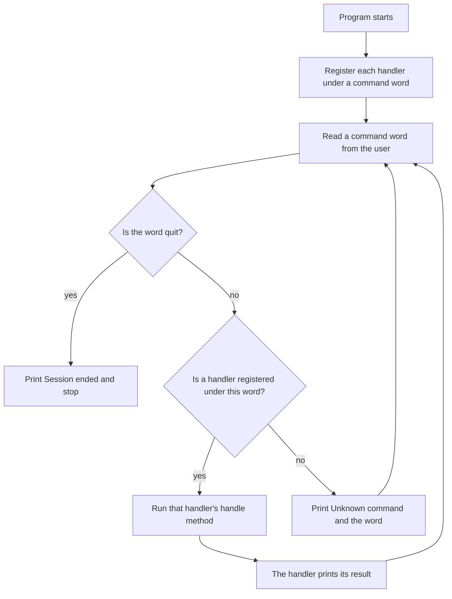

# Lesson 8.1: Event-Driven Programming

**Module:** 8 — Events and Capstone (submodule 8.1)  
**Estimated time:** 100–120 minutes  
**Prerequisites:** You can write a class with private fields, a constructor using `this`, and methods. You can write a sentinel-controlled loop and hold objects in an `ArrayList`.

---

## Learning goal

After this lesson, you can:

- State what an event is, and what the register-and-dispatch cycle does.
- Read an `interface` and say what it does and does not supply.
- Write a class that `implements` an interface and supplies the method the interface names.
- Register a handler under a command word and dispatch a typed word to it.
- Explain why the logic class never learns what triggered a call.

---

## Prior knowledge check

Before starting, confirm you can do the following:

- [ ] Write a class with `private` fields, a constructor using `this`, getters, and `toString`.
- [ ] Write a sentinel-controlled loop that reads until a stop value arrives.
- [ ] Declare an `ArrayList`, add to it, and read it with `get` and `size`.
- [ ] Compare two `String` values with `.equals`.

If you cannot do all four, review Modules 3, 4, 6, and 7 before continuing.

---

## Concept explanation

### An event is a user action that runs a method you wrote

Every program so far decided for itself what happened next. An **event-driven** program waits
instead. The user does something — types a command, presses a button — and that action runs a
method you wrote in advance.

**The calculator analogy.** On a calculator, pressing `=` is the signal "I have finished
entering numbers, now execute." That press is the **event**. The calculation that follows is
the **handler**. You did not decide when the press would happen. You decided in advance what
would happen when it did.

### The register-and-dispatch cycle

The cycle has two halves, and they happen at different times.

| Half | When it happens | What it does |
|------|----------------|--------------|
| **Register** | Once, before any event arrives | Record which handler answers to which command word. Nothing runs. |
| **Dispatch** | Every time an event arrives | Look the word up, and run the handler recorded under it. |

```java
// Register: four lines, no calculation performed.
dispatcher.register("add", new AddHandler(engine));
dispatcher.register("subtract", new SubtractHandler(engine));
dispatcher.register("equals", new EqualsHandler(engine));
dispatcher.register("clear", new ClearHandler(engine));

// Dispatch: one line, run for every command the user types.
boolean handled = dispatcher.dispatch(command, value);
```



**Plain-text description:** The program starts and first registers each handler under a command
word; nothing runs during registration. It then reads a command word from the user. The first
decision asks whether the word is `quit`: when it is, the program prints `Session ended` and
stops. When it is not, a second decision asks whether a handler is registered under that exact
word. When one is, that handler's `handle` method runs and prints its result, and control
returns to reading the next word. When no handler is registered, the program prints
`Unknown command` followed by the word, and control returns to reading the next word. The
reading step is reached again from both paths, which is what makes this a loop.

### `interface` and `implements`

An **interface** names a method and supplies no body.

```java
interface CommandHandler {
    void handle(double value);
}
```

That is the whole declaration. It states a return type, a name, and a parameter list, and it
holds no code at all.

`implements` obliges a class to supply a method of exactly that shape.

```java
class AddHandler implements CommandHandler {

    private CalculatorEngine engine;

    public AddHandler(CalculatorEngine engine) {
        this.engine = engine;
    }

    @Override
    public void handle(double value) {
        this.engine.add(value);
        System.out.println("Added " + value);
    }
}
```

Delete `handle`, or misspell it as `Handle`, and the class does not compile: the compiler
reports that `AddHandler` is not abstract and does not override `handle`. The obligation is
checked, which is what makes an interface worth more than an agreement written in a comment.

**The variable's declared type may be the interface.** This is the reason interfaces exist:

```java
ArrayList<CommandHandler> handlers = new ArrayList<>();
handlers.add(new AddHandler(engine));
handlers.add(new ClearHandler(engine));
```

The list holds two different classes. Code that reads the list can call `handle` on any of them
without knowing which class answers.

**A handler may ignore the value it is given.** `EqualsHandler.handle` never looks at `value`.
The interface fixes the shape of the method, not what the method does with its parameter.

### Why the logic class never learns what triggered it

```java
class CalculatorEngine {
    private double total = 0.0;
    public void add(double value) { this.total = this.total + value; }
    public double total() { return this.total; }
}
```

Nothing in this class refers to a command word, a keyboard, or a button. It is a Module 7
class: private field, methods that change and report it. That separation is the point of the
whole design, and it is what the next section rests on.

### The same handlers, wired to a button — local surface only

The block below is not shipped as a runnable file. A Codespace has no display, so a window
program cannot produce output for the verifier to check. Students working on a local machine
may wire the same handler classes to Swing buttons.

```java
// Local surface only. Not part of any file in this repository.
import java.awt.event.ActionEvent;
import java.awt.event.ActionListener;
import javax.swing.JButton;

/** Turns a button press into a call on a CommandHandler. */
class AddButtonListener implements ActionListener {

    private CommandHandler handler;

    public AddButtonListener(CommandHandler handler) {
        this.handler = handler;
    }

    @Override
    public void actionPerformed(ActionEvent event) {
        // The same handle method the console dispatcher calls.
        this.handler.handle(5.0);
    }
}

// Wiring, written once where the window is built:
JButton addButton = new JButton("Add 5");
addButton.addActionListener(new AddButtonListener(new AddHandler(engine)));
```

Compare the two registration lines:

```java
dispatcher.register("add", new AddHandler(engine));      // console
addButton.addActionListener(new AddButtonListener(new AddHandler(engine)));   // Swing
```

`AddHandler` and `CalculatorEngine` are unchanged between them. Only the trigger differs.

**The console path is not the lesser one.** CLO-4 asks you to process a user event as a
function call. A menu selection does that and a button press does that, and both are accepted
evidence in full. See the [Course Map](../../docs/course-map.md#module-8--events-and-capstone).

Key terms introduced in this lesson:

- **Event:** a user action that runs a method written in advance.
- **Handler:** the method that runs when an event arrives, and the class that supplies it.
- **Register:** record which handler answers to which command word.
- **Dispatch:** look up a word and run the handler recorded under it.
- **Interface:** a declaration that names a method and supplies no body.
- **`implements`:** the obligation on a class to supply the methods an interface names.

---

## Worked example

### First, the smallest interface

`examples/HandlerIntro.java` holds one interface, two classes that supply its method, and a
`main` that calls each through a variable whose declared type is the interface.

```java
// HandlerIntro.java — see examples/HandlerIntro.java for the full runnable version.

public class HandlerIntro {
    public static void main(String[] args) {
        Greeter morning = new MorningGreeter();
        Greeter evening = new EveningGreeter();

        System.out.println(morning.greet("Avery"));
        System.out.println(evening.greet("Avery"));
    }
}

interface Greeter {
    String greet(String name);
}

class MorningGreeter implements Greeter {
    @Override
    public String greet(String name) {
        return "Good morning, " + name + ".";
    }
}

class EveningGreeter implements Greeter {
    @Override
    public String greet(String name) {
        return "Good evening, " + name + ".";
    }
}
```

**Expected output:**
```
Good morning, Avery.
Good evening, Avery.
Good morning, Brooks.
Good evening, Brooks.
```

**What to notice:**

- `morning` is declared as a `Greeter` and holds a `MorningGreeter`. That is allowed because
  `MorningGreeter implements Greeter`.
- The `println` line is identical for both. The variable decides which class answers.
- The interface is named `Greeter` rather than `CommandHandler` on purpose. The verifier
  compiles every file in the folder together when it runs the tests, and two files declaring the
  same type would collide.

### Then, the dispatcher

`examples/EventDemo.java` is the console dispatcher, and every type it needs lives in that one
file. Read it in full. Its parts:

| Type | What it is | What it holds |
|------|-----------|---------------|
| `EventDemo` | The `public` class | `main`: registers four handlers, then runs the command loop |
| `CommandHandler` | The interface | `void handle(double value)` and nothing else |
| `CommandDispatcher` | The lookup | Two parallel `ArrayList` values: the words, and the handlers |
| `CalculatorEngine` | The logic | A running total, with `add`, `subtract`, `total`, and `clear` |
| `AddHandler` and three more | The handlers | Each holds one engine and supplies `handle` |

**The two parallel lists.** The handler for `commands.get(i)` is `handlers.get(i)`. Looking a
word up means walking the first list with `.equals` and using the index in the second:

```java
public boolean dispatch(String command, double value) {
    for (int i = 0; i < this.commands.size(); i++) {
        if (this.commands.get(i).equals(command)) {
            this.handlers.get(i).handle(value);
            return true;
        }
    }
    return false;
}
```

A map would be shorter and is not taught in this course. Two lists use only what Module 6 gave
you, and the `.equals` on that line is the Module 3 comparison, in the one place where writing
`==` instead makes every handler look dead.

**The command loop** is the sentinel loop from Module 4, with a word in place of a number:

```java
boolean running = true;
while (running) {
    System.out.print("> ");
    String command = input.next();

    if (command.equals("quit")) {
        running = false;
    } else {
        double value = 0;
        if (command.equals("add") || command.equals("subtract")) {
            value = input.nextDouble();
        }

        boolean handled = dispatcher.dispatch(command, value);
        if (!handled) {
            System.out.println("Unknown command: " + command);
        }
    }
}
```

Only `add` and `subtract` carry a value, so only those two read one. Every other command is
dispatched with `0`, and its handler ignores what it was given.

---

## Trace before running

**Task:** Trace `examples/EventDemo.java` against its recorded input,
`examples/EventDemo.stdin`. Do not run it yet.

The fixture holds these nine lines:

```
add 5
add 7.5
equals
subtract 2.5
equals
clear
equals
multiply
quit
```

Fill in one row per command.

| Command | Handler that runs | Line printed after the `> ` prompt | `engine.total()` after |
|---------|------------------|-----------------------------------|------------------------|
| `add 5` | ______ | ______ | ______ |
| `add 7.5` | ______ | ______ | ______ |
| `equals` | ______ | ______ | ______ |
| `subtract 2.5` | ______ | ______ | ______ |
| `equals` | ______ | ______ | ______ |
| `clear` | ______ | ______ | ______ |
| `equals` | ______ | ______ | ______ |
| `multiply` | ______ | ______ | ______ |
| `quit` | ______ | ______ | ______ |

**Prediction questions — write your answers before running:**

1. What does the program print before it reads anything?
2. Which command changes the total without printing it, and which prints it without changing
   it?
3. What happens when `multiply` arrives, and which method decided that?
4. Does `quit` reach the dispatcher? State why.
5. Where does the `5` in `add 5` get read, and which `if` decided to read it?

<details>
<summary>Answers — open only after filling in the table and writing your predictions</summary>

| Command | Handler | Printed | `total()` after |
|---------|---------|---------|-----------------|
| `add 5` | `AddHandler` | `Added 5.0` | 5.0 |
| `add 7.5` | `AddHandler` | `Added 7.5` | 12.5 |
| `equals` | `EqualsHandler` | `Total: 12.5` | 12.5 |
| `subtract 2.5` | `SubtractHandler` | `Subtracted 2.5` | 10.0 |
| `equals` | `EqualsHandler` | `Total: 10.0` | 10.0 |
| `clear` | `ClearHandler` | `Cleared.` | 0.0 |
| `equals` | `EqualsHandler` | `Total: 0.0` | 0.0 |
| `multiply` | none | `Unknown command: multiply` | 0.0 |
| `quit` | none | nothing | 0.0 |

Full expected output:
```
Registered commands: 4
Type add <value>, subtract <value>, equals, clear, or quit.
> Added 5.0
> Added 7.5
> Total: 12.5
> Subtracted 2.5
> Total: 10.0
> Cleared.
> Total: 0.0
> Unknown command: multiply
> 
Session ended.
```

1. `Registered commands: 4` and the line listing the commands. Registration happens before the
   loop starts, and `registeredCount()` reports what it recorded.
2. `add` and `subtract` change the total and print what they did, not the total.
   `equals` prints the total and changes nothing. `clear` changes the total and prints
   `Cleared.` rather than the new value.
3. `dispatch` walks the list of registered words, finds no match, changes nothing, and returns
   `false`. `main` then prints `Unknown command: multiply`. The dispatcher decided; the engine
   was never called.
4. No. `main` tests for `quit` **before** it reaches the dispatcher, so `quit` is not a
   registered command and does not need to be.
5. In `main`, by `input.nextDouble()`, guarded by
   `if (command.equals("add") || command.equals("subtract"))`. The dispatcher receives the value
   already read; it never touches the keyboard.

**Note the two `> ` prompts that look wrong and are not.** `System.out.print("> ")` does not end
the line, so each prompt shares a line with whatever the handler prints next. The bare `> ` near
the end is the prompt that read `quit`, which printed nothing.

</details>

---

## Repair code

The following dispatcher contains **two errors**. Find them, fix them, and explain each repair.
Do not run the code until you have written your explanations.

The program should print `Added 5.0` for the typed command `add 5`. It prints
`Unknown command: add` instead.

```java
// Abridged. The interface, the engine, and AddHandler are unchanged from EventDemo.java.

class CommandDispatcher {

    private ArrayList<String> commands = new ArrayList<>();
    private ArrayList<CommandHandler> handlers = new ArrayList<>();

    public void register(String command, CommandHandler handler) {
        this.commands.add(command);
        this.handlers.add(handler);
    }

    public boolean dispatch(String command, double value) {
        for (int i = 0; i < this.commands.size(); i++) {
            if (this.commands.get(i) == command) {      // error 2
                this.handlers.get(i).handle(value);
                return true;
            }
        }
        return false;
    }
}

public class RepairDispatcher {
    public static void main(String[] args) {
        Scanner input = new Scanner(System.in);
        CalculatorEngine engine = new CalculatorEngine();
        CommandDispatcher dispatcher = new CommandDispatcher();

        dispatcher.register("Add", new AddHandler(engine));      // error 1

        String command = input.next();
        double value = input.nextDouble();

        if (!dispatcher.dispatch(command, value)) {
            System.out.println("Unknown command: " + command);
        }
        input.close();
    }
}
```

**Errors to find:**

1. The word the handler is registered under.
2. The comparison inside the lookup.

**Predict before you repair.** Both defects have the same symptom: the handler never runs, it
prints nothing, and no error appears anywhere. Write down what you would
check first if this were your own program and you had not been told there were two defects.

<details>
<summary>Corrections — open only after writing your explanations</summary>

1. **`"Add"` is not `"add"`.** The comparison is exact, so a handler registered under one
   spelling and dispatched under the other never runs. `isRegistered("add")` returns `false`
   while `isRegistered("Add")` returns `true`, which is the pair of calls that names this
   defect in one step. The repair is `dispatcher.register("add", new AddHandler(engine));`.

2. **`==` compares references, not characters.** `commands.get(i)` holds a literal from your
   source, and `command` holds a `String` that `Scanner` built from what the user typed. Those
   are two different objects, so the test is `false` for every entry in the list, and `dispatch`
   always returns `false`. The repair is `this.commands.get(i).equals(command)`.

   This is the Module 3 defect, arriving in the place where it costs the most. A dead branch in
   a price chain prints a wrong number. A dead lookup here makes every handler in the program
   look like code that is never called.

**The diagnostic that separates them.** Fix error 2 alone and the program still prints
`Unknown command: add`, because the registered word is still `"Add"`. Fix error 1 alone and it
still fails, because `==` never matches. Two defects with one symptom is the case where
"change one thing and run again" pays for itself: neither single change moves the output, and
that is information rather than a dead end.

Add this line before the dispatch to see the state directly:

```java
System.out.println("registered under add? " + dispatcher.isRegistered("add"));
```

</details>

---

## Execute-gate handshake

You are now going to write your own dispatcher. Complete the handshake with your coach before
writing any code.

**Coach provides this task:**

> Write `Kiosk.java`, a self-contained console program holding:
>
> - `interface CommandHandler` with the single method `void handle(double value)`.
> - `class CommandDispatcher` with `register`, `dispatch`, and `registeredCount`, using two
>   parallel `ArrayList` values and `.equals` for the lookup.
> - `class BalanceEngine` with a private balance, and the methods `deposit`, `withdraw`, and
>   `balance()`.
> - Two handlers of your own: `DepositHandler` and `WithdrawHandler`.
> - An `EqualsHandler` that reports the balance. It is named `equals` because it plays the part
>   the `=` key plays on a calculator: the command that asks for the result.
> - A `main` that registers the three handlers, then runs a sentinel loop ending on `quit`.
>
> Constraints: One `public` class named `Kiosk`; every other type is package-private in the same
> file, as they are in `EventDemo.java`. No `HashMap` and no `Integer.parseInt` — neither is
> taught in this course. Compare command words with `.equals`. An unregistered command prints
> `Unknown command: ` and the word, and changes nothing.

**Player: complete the handshake using this format:**

```
Goal: The program must ______.
Constraints: I may ______. I may not ______.
Prediction: For deposit 50 then equals I expect ______.
            For equals before any other command I expect ______.
            For the command xyz I expect ______.
Success check: We know it works when ______.
```

**Gate opens when the coach says: "Agreed."**

---

## Small coding task

Write `Kiosk.java` as the handshake describes.

**Required output for the commands `deposit 50`, `equals`, `withdraw 20`, `equals`, `xyz`,
`quit`:**

```
Registered commands: 3
Type deposit <value>, withdraw <value>, equals, or quit.
> Deposited 50.0
> Balance: 50.0
> Withdrew 20.0
> Balance: 30.0
> Unknown command: xyz
> 
Session ended.
```

Then run the module's tests:

```
bash scripts/fetch-junit.sh      # once per machine or Codespace
bash scripts/verify.sh test
```

`tests/CommandDispatcherTest.java` states the contract your dispatcher copies: what `dispatch`
returns for a registered word and for an unregistered one, what `registeredCount()` reports when
a word is registered twice, and that `isRegistered("Add")` is `false` while `isRegistered("add")`
is `true`. Read those test names against your own `CommandDispatcher` and check that yours would
satisfy each one.

---

## Test evidence

Record all three tiers after running.

| Tier | Commands typed | Expected | Actual | Match? |
|------|---------------|----------|--------|--------|
| **Normal** | `deposit 50` then `equals` | `Deposited 50.0` then `Balance: 50.0` | | |
| **Boundary** | `equals` as the very first command | `Balance: 0.0` — the handler ran, and there was nothing to report but the starting value | | |
| **Failure** | `xyz` | `Unknown command: xyz`, and a following `equals` still reports the balance from before | | |

The failure tier has two halves, and the second half is the one that matters. It is not enough
that the program prints the message: the state must be **unchanged**. Type `deposit 50`, then
`xyz`, then `equals`, and confirm the balance is still `50.0`.

---

## Explanation

Answer these questions in writing or out loud to your coach:

1. Trace one command from the keyboard to the printed line, naming each method it passes
   through.
2. What does `register` do, and what does it deliberately not do?
3. Your `BalanceEngine` contains no command word anywhere. Why is that worth having?
4. What evidence shows that an unregistered command changed nothing?

---

## Role rotation

Switch roles with your partner. The new coach describes the transfer task below. The new player
restates the goal and completes the handshake before writing any code.

---

## Transfer task

**Changed condition:** A command the dispatcher has never seen is added, and the dispatcher and
every handler you already wrote stay untouched.

**Coach provides this task:**

> Add a `multiply` command to your `Kiosk.java`. Typing `multiply 2` doubles the balance.
>
> Write one new handler class, `MultiplyHandler`, and add one `register` line for it. Add one
> method to `BalanceEngine` for the arithmetic.
>
> Constraints: **Change no line of `CommandDispatcher`, `DepositHandler`, `WithdrawHandler`, or
> `EqualsHandler`.** Show your coach the before-and-after of those four types and state that
> nothing in them moved.
>
> Test with `deposit 50`, `multiply 2`, `equals`, then `quit`.

**Player: complete the full handshake before writing code.**

<details>
<summary>Expected output (check after running)</summary>

```
Registered commands: 4
Type deposit <value>, withdraw <value>, multiply <value>, equals, or quit.
> Deposited 50.0
> Multiplied by 2.0
> Balance: 100.0
> 
Session ended.
```

`Registered commands:` reports `4` rather than `3`, and that number is your first piece of
evidence: `registeredCount()` reads the list, and the list grew because one `register` line was
added.

**The claim being assessed is what did not change.** `CommandDispatcher` never mentions `add`,
`deposit`, or `multiply`. It walks a list. A word it has never seen becomes reachable the moment
something registers a handler under it, and no line of the lookup is touched. The three handlers
you wrote earlier do not know that a fourth exists.

Two details need care, and both were rehearsed. Your `main` reads a value only for the commands
that carry one, so `multiply` joins the `if` that decides which commands read a number — the
Module 3 `||` chain. And `MultiplyHandler` implements `CommandHandler`, so its method has to be
exactly `public void handle(double value)`; a misspelling is a compile error rather than a
silent failure, which is what the interface is for.

</details>

---

## Reflection

Answer one of the following:

- Both defects in the Repair beat produced the same symptom, and neither single fix changed the
  output. What will you do the next time one change fails to move the result?
- The Swing block and the console loop call the same `AddHandler`. Explain to a classmate, in
  two sentences, why the engine needs no change between the two.
- What question do you still have about interfaces, or about what `register` records?

---

## Mastery record

| Skill | Not yet | Developing | Secure |
|-------|---------|------------|--------|
| State what an event is | ☐ | ☐ | ☐ |
| Name the two halves of the register-and-dispatch cycle | ☐ | ☐ | ☐ |
| Read an interface and say what it supplies | ☐ | ☐ | ☐ |
| Write a class that `implements` an interface | ☐ | ☐ | ☐ |
| Hold objects of several classes under one interface type | ☐ | ☐ | ☐ |
| Register a handler under a command word | ☐ | ☐ | ☐ |
| Dispatch a typed word with `.equals` | ☐ | ☐ | ☐ |
| Handle an unregistered command without changing state | ☐ | ☐ | ☐ |
| Explain why the logic class never learns what triggered it | ☐ | ☐ | ☐ |
| Complete the execute-gate handshake | ☐ | ☐ | ☐ |
| Record normal, boundary, and failure evidence | ☐ | ☐ | ☐ |
| Coach role completed | ☐ | ☐ | ☐ |
| Transfer task (`multiply`) completed independently | ☐ | ☐ | ☐ |
